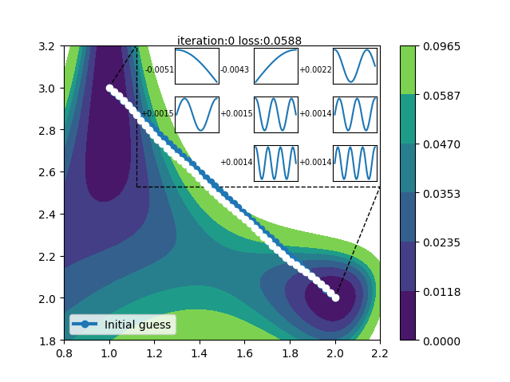

## <center>Optimizing Mode Connectivity for Class Incremental Learning (ICML 2023)

This is the official code for "Optimizing Mode Connectivity for Class Incremental Learning", accepted by ICML 2023.

Paper link: http://proceedings.mlr.press/v202/wen23b/wen23b.pdf

### Abstract
Class incremental learning (CIL) is one of the most challenging scenarios in continual learning. Existing work mainly focuses on strategies like memory replay, regularization, or dynamic architecture but ignores a crucial aspect: mode connectivity. Recent studies have shown that different minima can be connected by a low-loss valley, and ensembling over the valley shows improved performance and robustness. Motivated by this, we try to investigate the connectivity in CIL and find that the high-loss ridge exists along the linear connection between two adjacent continual minima. To dodge the ridge, we propose parameter-saving OPtimizing Connectivity (OPC) based on Fourier series and gradient projection for finding the low-loss path between minima. The optimized path provides infinite low-loss solutions. We further propose EOPC to ensemble points within a local bent cylinder to improve performance on learned tasks. Our scheme can serve as a plug-in unit, extensive experiments on CIFAR-100, ImageNet-100, and ImageNet-1K show consistent improvements when adapting EOPC to existing representative CIL methods.
<div align=center></div>

### Environment

#### Code Environment

- python==3.9
- pytorch==1.11.0
- continuum==1.2.4
- ...

The required packages are listed in files 'config/requirements.txt' and 'config/env.yml'. We recommend using Anaconda to manage packages, such as:
```
conda create -n torch1.11.0 python=3.9
conda activate torch1.11.0
conda install pytorch==1.11.0 torchvision==0.12.0 torchaudio==0.11.0 cudatoolkit=11.3 -c pytorch
cd config
pip install -r requirements.txt
```

#### Dataset

Folder Structures
```
├── data
│   ├── cifar-100-python
│   ├── ImageNet
│   ├── ImageNet100
```
The CIFAR-100 dataset can be automatically downloaded by running an arbitrary script of CIFAR-100 experiments. The [ImageNet](https://image-net.org) dataset must be pre-downloaded. The ImageNet-100 dataset can be generated by the script 'tool/gen_imagenet100.py'.

### Experiments
- PODNet
```
python main.py --cfg config/replay/podnet/podnet_cifar100.yaml
```

- AANet

```
python main.py --cfg config/structure/aanet/podnet/aanet_podnet_cifar100.yaml
```

- PODNet w/ EOPC

```
python main.py --cfg config/replay/opc/podnet/opc_podnet_cifar100.yaml
```

- AANet w/ EOPC

```
python main.py --cfg config/replay/opc/aanet/opc_aanet_cifar100.yaml
```

### Notes
The current implementation of OPC may be time-consuming, this is because we need to manually propagate the gradient of the model back to the parameters of the path. Secondly, the Rosen optimizer is a general optimizer to make parameters meet the equality constraint (keep passing through connected endpoints) and constrain parameters within a predefined boundary (make optimization more stable, OPC does not need boundary constraints), which is not the optimal implementation for OPC.

If you want to accelerate the optimization of the path, adjusting the epochs for OPC to 2 (in the case of ImageNet-1000) can also get good results.
Sorry for this inconvenience, we will continuously optimize the implementation.

In addition, this code framework can simultaneously support the 3 continual learning scenarios: task incremental learning, domain incremental learning, and class incremental learning. If you find this code framework easy to use, you can also use it as your development environment. We will integrate more continual learning methods and release a more general code framework in the future.

### Acknowledgements

We appreciate the following GitHub repos a lot for their valuable code base:
- https://github.com/arthurdouillard/incremental_learning.pytorch
- https://github.com/yaoyao-liu/POD-AANets

### Citation
We hope that our research can help you and promote the development of continual learning.
If you find this work useful, please consider citing the corresponding paper:
```
@InProceedings{pmlr-v202-wen23b,
  title = {Optimizing Mode Connectivity for Class Incremental Learning},
  author = {Wen, Haitao and Cheng, Haoyang and Qiu, Heqian and Wang, Lanxiao and Pan, Lili and Li, Hongliang},
  booktitle = {Proceedings of the 40th International Conference on Machine Learning},
  pages = {36940--36957},
  year = {2023},
  volume = {202},
  publisher = {PMLR}
}
```
